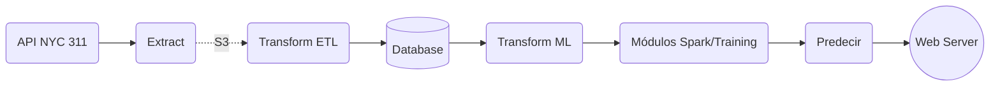

# 311 NYC Service Request Web-Service
***

### Integrantes:

- Cadavid Sánchez Sebastián, [C1587S](https://github.com/C1587S)
- Herrera Musi Juan Pablo, [Pilo1961](https://github.com/Pilo1961)
- Paz Cendejas Francisco, [MrFranciscoPaz](https://github.com/MrFranciscoPaz)
- Villa Lizárraga Diego M., [dvilla88](https://github.com/dvilla88)
- Pinto Veizaga Daniela, [dapivei](https://github.com/dapivei)

### Contenidos de sitio:

### Introducción:

### Predicción:

Tiempo estimado de resolución de un *service request*

### Data Product Architecture:

<image width="900" height="130" src="https://github.com/dapivei/data-product-architecture-final-project/blob/master/images/mockup.png">

### Producto Final:

  <image width="350" height="250" src="https://github.com/dapivei/data-product-architecture-final-project/blob/master/images/web_service_proposal.png">

