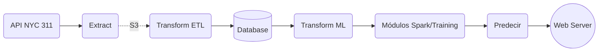

# 311 NYC Service Request Web-Service
***

### Integrantes:

- Cadavid Sánchez Sebastián, [C1587S](https://github.com/C1587S)
- Herrera Musi Juan Pablo, [Pilo1961](https://github.com/Pilo1961)
- Paz Cendejas Francisco, [MrFranciscoPaz](https://github.com/MrFranciscoPaz)
- Villa Lizárraga Diego M., [dvilla88](https://github.com/dvilla88)
- Pinto Veizaga Daniela, [dapivei](https://github.com/dapivei)

### Contenidos de sitio:

- [X] I. Introducción

- [X] II. Problema

- [X] III. Objetivos del producto de datos

- [ ] IV. Métricas de Desempeño

- [ ] V. Datos requeridos

- [X] VI. Solución Propuesta: Producto final

- [ ] VII. Modelos utilizados

- [ ] VIII. Implementación

- [ ] IX. Conclusión

### I. Introducción:

El gobierno de Nueva York, con el fin de proveer a la comunidad *newyorkina* con acceso directo a los servicios gubernamentales  y mejorar el seguimiento y control de los servicios gubernamentales, provee el servicio de petición *NYC311*, disponible las 24 horas del día, los 7 días de la semana, los 365 días del año. De esta manera, según el portal web principal de [*NYC311*](https://portal.311.nyc.gov/about-nyc-311/), la misión del servicio de petición es:

>* "es proporcionar al público un acceso rápido y fácil a todos los servicios e información del gobierno de la ciudad de Nueva York al tiempo que ofrece el mejor servicio al cliente. Ayudamos a las agencias a mejorar la prestación de servicios permitiéndoles centrarse en sus misiones principales y administrar su carga de trabajo de manera eficiente. También proporcionamos información para mejorar el gobierno de la Ciudad a través de mediciones y análisis precisos y consistentes de la prestación de servicios".

**Gráfica 1.Portal-Web "NYC311 Service Request**

<image width="380" height="330" src="https://github.com/dapivei/data-product-architecture-final-project/blob/master/images/nyc_311_sr_website.png">

### II. Problema

Existe una brecha, aparentemente "infranqueable" entre el Estado y la ciudadanía, dónde los ciudadanos carecen de herramientas adecuadas para monitorear, participar y colaborar en el quehacer público. En este sentido la línea de peticiones NYC311 es una iniciativa para conectar el quehacer gubernamental con los ciudadanos a través de un línea disponible para levantar quejas y peticiones a las diferentes agencias gubernamentales. Sin embargo, este servicio aún es incipiente en el sentido que el ciudadano, hasta el momento, no cuenta con una herramienta eficaz de seguimiento a sus requerimientos, mediante la dotación de un tiempo estimado de resolución de su petición y de una métrica de control de tiempo estimado de respuesta, en comparación con otras peticiones de índole similar. 

### III. Objetivos del producto de datos

El desarrollo de este producto de datos tiene los siguientes objetivos:

* Proporcionar a todo el público una herramienta de seguimiento y control de las peticiones realizadas a la línea 311 en la ciudad de Nueva York por medio de una estimación en el tiempo de respuesta del problema;

* Proporcionar una herramienta que permita a las agencias estatales reubicar de manera óptima sus recursos para atender mejor a los requerimientos en las llamadas de los ciudadanos;

* Evaluar la efectividad en pronóstico del tiempo de respuesta estimado por las agencias;

* Medir la divergencia en el tiempo de respuesta por distritos de la ciudad, por agencia y por tipo de solicitud.

#### a. Predicción:

Tiempo estimado de resolución de un *service request*

#### b. Data Product Architecture:

**Gráfica 2.Data Product Pipeline**

<image width="900" height="130" src="https://github.com/dapivei/data-product-architecture-final-project/blob/master/images/mockup.png">

    
**Gráfica 3. Extract, Load and Transform(ELT)**

<image width="900" height="130" src="https://github.com/dapivei/data-product-architecture-final-project/blob/master/images/etl_extended_new.png">

  
    
#### c. Extract, Transform and Load (ETL)

##### Extract

+ Bajar info (Pandas Script)

+ Formato (Json)

+ Bucket: S3 Amazon Web Service

+ Periodicidad: Diaria

##### Transform

+ Schema (Raw, Clean, Semantic)

+ Clean: Formato y Estructura

¿Qué hacemos? Script: 1) Crear la base con formatos y columnas (SQL); 2) Transformamos los datos (siempre)

##### Load

+ Script: Insertar registros: siempre

+ Parquet (Raw + Transform) SQL

+ En qué formato los guardamos?

### IV. Métricas de Desempeño

### V. Datos/variables requeridas

+ unique key
+ created date 
+ updated 
+ resolution
+ closed 
+ due date 
+ agency
+ complaint type
+ demographic variables 
+ status 

### VI. Solución Propuesta: Producto Final

**Gráfica 3.Portal-Web "NYC311 Service Request Engagement"**

  <image width="350" height="250" src="https://github.com/dapivei/data-product-architecture-final-project/blob/master/images/web_service_proposal.png">

    
### VII. Modelos utilizados

### VIII. Implementación

### IX. Conclusión

