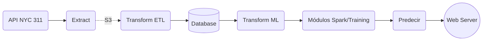

# 311 NYC Service Request Web-Service
***

### Integrantes:

- Cadavid Sánchez Sebastián, [C1587S](https://github.com/C1587S)
- Herrera Musi Juan Pablo, [Pilo1961](https://github.com/Pilo1961)
- Paz Cendejas Francisco, [MrFranciscoPaz](https://github.com/MrFranciscoPaz)
- Villa Lizárraga Diego M., [dvilla88](https://github.com/dvilla88)
- Pinto Veizaga Daniela, [dapivei](https://github.com/dapivei)

### Contenidos de sitio:

### Introducción:

El gobierno de Nueva York, con el fin de proveer a la comunidad *newyorkina* con acceso directo a los servicios gubernamentales  y mejorar el seguimiento y control de los servicios gubernamentales, provee el servicio de petición *NYC311*, disponible las 24 horas del día, los 7 días de la semana, los 365 días del año. De esta manera, según el portal web principal de [*NYC311*](https://portal.311.nyc.gov/about-nyc-311/), la misión del servicio de petición es:

>* "es proporcionar al público un acceso rápido y fácil a todos los servicios e información del gobierno de la ciudad de Nueva York al tiempo que ofrece el mejor servicio al cliente. Ayudamos a las agencias a mejorar la prestación de servicios permitiéndoles centrarse en sus misiones principales y administrar su carga de trabajo de manera eficiente. También proporcionamos información para mejorar el gobierno de la Ciudad a través de mediciones y análisis precisos y consistentes de la prestación de servicios".

### Predicción:

Tiempo estimado de resolución de un *service request*

### Data Product Architecture:

<image width="900" height="130" src="https://github.com/dapivei/data-product-architecture-final-project/blob/master/images/mockup.png">

### Producto Final:

  <image width="350" height="250" src="https://github.com/dapivei/data-product-architecture-final-project/blob/master/images/web_service_proposal.png">

